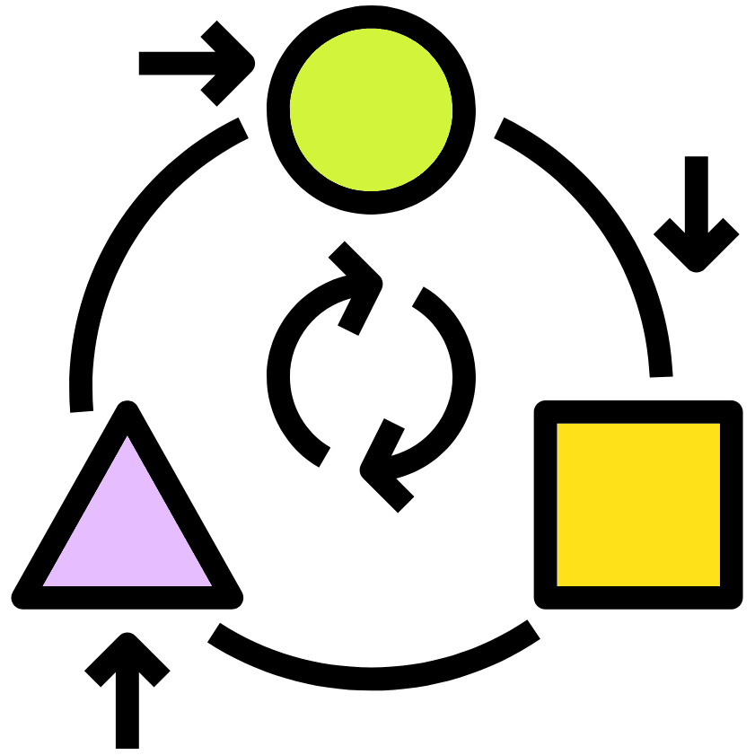

```{r cite-packages, include = FALSE}
# automatically create a bib database for R packages
# add any packages you want to cite here
knitr::write_bib(c(
  .packages(), 'bookdown', 'webexercises'
), 'packages.bib')
```

```{r, fig.align = 'center',out.width= '30%', echo=FALSE }
knitr::include_graphics(path = "figures/NEOF.png", auto_pdf = TRUE)
```

# Introduction {#intro}

```{r, fig.align = 'center',out.width= '20%', echo=FALSE }
knitr::include_graphics(path = "figures/map.png", auto_pdf = TRUE)
```

This practical session aims to introduce you to Linux and its applications. The topics covered are:

+:-------------------------------------------------------------------:+:----------------------------------------------------------------:+
| [**What is Linux?**](#linuxintro)                                   | [**Logging in to our teaching VNC**](#cluster)                   |
|                                                                     |                                                                  |
| [{width="142"}](#linuxintro)         | [{width="189"}](#cluster)                  |
+---------------------------------------------------------------------+------------------------------------------------------------------+
| [**Directories and files**](#dirsandfiles)                          | [**Tips and tricks**](#tipsandtricks)                            |
|                                                                     |                                                                  |
| [{width="125"}](#dirsandfiles)            | [{width="302"}](#tipsandtricks) |
+---------------------------------------------------------------------+------------------------------------------------------------------+
| [**Manipulating Directories**](#manipulatingdirectories)            | [**File reading and processing**](#filereadingandprocessing)     |
|                                                                     |                                                                  |
| [{width="150"}](#manipulatingdirectories) | [{width="205"}](#filereadingandprocessing) |
+---------------------------------------------------------------------+------------------------------------------------------------------+
| [**Advanced Linux**](#advancedlinux)                                | [**Other Bioinformatics programming languages**](#bfxlanguages)  |
|                                                                     |                                                                  |
| [{width="142"}](#advancedlinux)   | [{width="159"}](#bfxlanguages)         |
+---------------------------------------------------------------------+------------------------------------------------------------------+
| [**Appendix**](#cheatsheet)                                         |                                                                  |
|                                                                     |                                                                  |
| [{width="150"}](#cheatsheet)             |                                                                  |
+---------------------------------------------------------------------+------------------------------------------------------------------+

The aim of this practical is to cover everything up to, but not including, Advanced Linux. This will give you sufficient skills in Linux to carry out the other practicals in this workshop. If you are already familiar with Linux or you are a quick learner, please look at the Advanced Linux session followed by the Other Bioinformatics programming languages.

Commands are in the following font, colour, and box.They should be run in the command line.

```{bash eval=FALSE}
echo "This is a command example" 
```

Additionally please use the [cheatsheet](#cheatsheet) as a reminder of all the commands you will be learning.

<a rel="license" href="http://creativecommons.org/licenses/by-nc-sa/4.0/"></a><br />This work is licensed under a <a rel="license" href="http://creativecommons.org/licenses/by-nc-sa/4.0/">Creative Commons Attribution-NonCommercial-ShareAlike 4.0 International License</a>.
