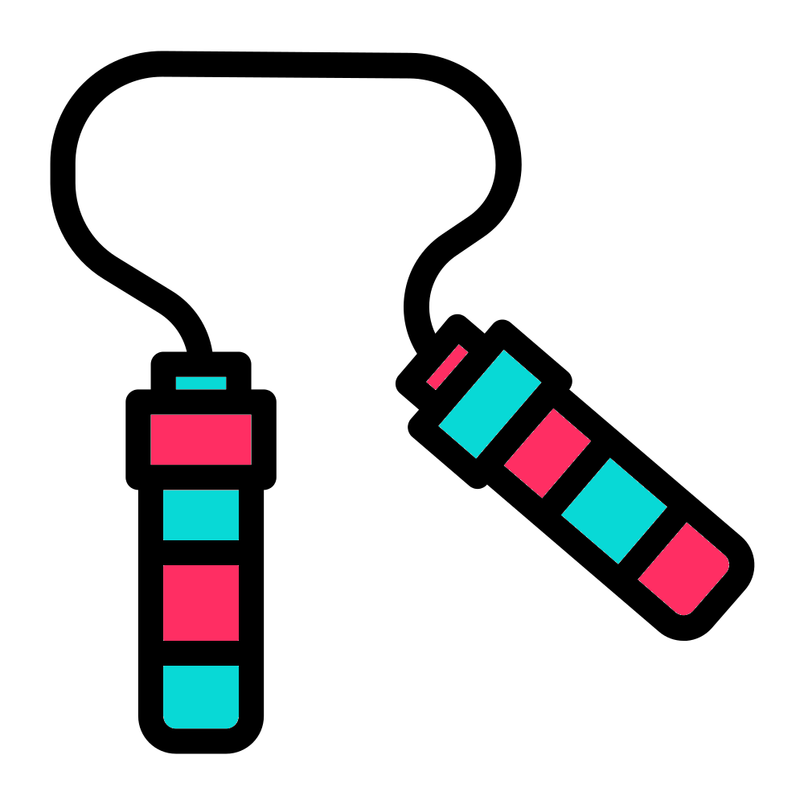

# Exercise 1
<center>
{style="width:200px; background:white; border-radius:5px"}
</center>

Perform the following tasks with the skills and knowledge you have gained.  

Before carrying out the tasks, ensure you are in your `~/Linux` directory.

You can check my solutions by clicking the expandable boxes like the one below ("Move to correct directory"). These are not the definitive solution but only examples of solutions. If your method works and you understand why then you have carried it out correctly.

`r hide("Move to correct directory")`
```{bash eval=FALSE}
cd ~/Linux/
```
`r unhide()`

## Exercise 1 tasks

### Task 1
<center>
{style="width:150px; background:white; border-radius:5px"}
</center>

Change the name of the subdirectory __"four_exercises"__ within your __"Linux"__ directory to __"4_exercises"__.

`r hide("Task 1 solution")`
```{bash eval=FALSE}
mv four_exercises 4_exercises
```
`r unhide()`

### Task 2 {-}
<center>
{style="width:150px; background:white; border-radius:5px"}
</center>

Make a backup of the __"4_exercises"__ directory 

`r hide("Task 2 solution")`
```{bash eval=FALSE}
cp -r 4_exercises 4_exercises_backup 
```
`r unhide()`

### Task 3 {-}
<center>
{style="width:150px; background:white; border-radius:5px"}
</center>

List the contents of the __"4_exercises"__ directory

`r hide("Task 3 solution")`
```{bash eval=FALSE}
ls 4_exercises
```
`r unhide()`

### Task 4 {-}
<center>
{style="width:150px; background:white; border-radius:5px"}
</center>

Within the directory __"4_exercises"__ 

  1. Print the working directory.
  2. Print out to screen the phrase ‘__the echo command allows me to print phrases to screen__’.
  3. Copy the file __"copy_this_file.txt"__ to the directory __"to_me"__ 
  4. Rename the directory __"to_me"__ to __"you"__
  5. Delete the initial __"copy_this_file.txt"__ file

`r hide("Task 4 solutions")`
First move into the "2_exercises" directory
```{bash eval=FALSE}
cd 4_exercises
```
Print the working directory
```{bash eval=FALSE}
pwd
```
Print out to screen the phrase ‘the echo command allows me to print phrases to screen’
```{bash eval=FALSE}
echo “the echo command allows me to print phrases to screen”
```
Copy the file copy_this_file.txt to the directory to_me
```{bash eval=FALSE}
cp copy_this_file.txt to_me
```
Rename the directory to_me to you
```{bash eval=FALSE}
mv to_me you
```
Delete the initial copy_this_file.txt file
```{bash eval=FALSE}
rm copy_this_file.txt
```
`r unhide()`
  
## Exercise 1 conclusion
<center>
{style="width:200px; background: white; border-radius:5px"}
</center>

Brilliant! I hope those tasks helped improve your Linux skills through application.

Please continue on with the materials and remember you can ask for help and look at the [cheatsheet](#cheatsheet).
