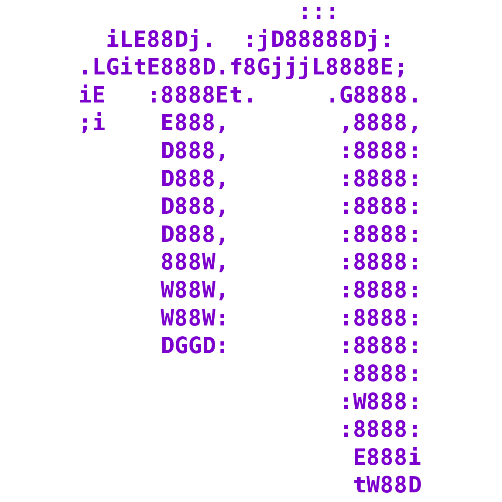

# (PART\*) Part 2 {-}

# File reading and processing {#filereadingandprocessing}
<center>
{style="width:200px"}
</center>

There are many ways to show the contents of a file. Below are a few examples. 

The files for the examples are within the directory:  __"/pub14/tea/nsc2xx/Linux/5_reading_files/"__ __(replace xxx with your user number)__.

`r hide("Chapter 8 video walk-through")`
<div class="container">
<iframe src="https://www.youtube.com/embed/rldLi1yAE58" 
frameborder="0" allowfullscreen class="video"></iframe>
</div>
`r unhide()`

## Print out a file
<center>
{style="width:200px; background: white; border-radius:5px"}
</center>

The `cat` command will print out the entire contents of a file to the screen. This is useful for small text files and pipelines (pipelines are not covered here).
Example commands are below (remember to replace xxx with your user name number):

__Note__: remember tab complete and using the arrow keys

Print contents of __"short_file.txt"__ to screen
```{bash eval=FALSE}
cat /pub14/tea/nsc2xx/Linux/5_reading_files/short_file.txt
``` 

Print contents of __"Scientist.txt"__ to screen
```{bash eval=FALSE}
cat /pub14/tea/nsc2xx/Linux/5_reading_files/Scientist.txt
``` 

Print contents of __"ecoli.gbk"__ to screen
```{bash eval=FALSE}
cat /pub14/tea/nsc2xx/Linux/5_reading_files/ecoli.gbk
``` 
__Remember__: The `clear` command.

## head and tail
<center>
{style="width:300px; border-radius:15px; background:white"}
</center>

The `head` command will print out to screen the top n lines of a file.

The `tail` command will print out to screen the bottom n lines of a file.

The default value is 10. The `-n` option can be used to indicate how many lines to print out.

Carry out the below commands in the directory __"/pub14/tea/nsc2xx/Linux/5_reading_files/"__

Print out the top 10 lines of __"ecoli.gbk"__
```{bash eval=FALSE}
head ecoli.gbk
``` 

Print out the bottom 10 lines of __"ecoli.gbk"__
```{bash eval=FALSE}
tail ecoli.gbk
``` 

Print out the top 25 lines of __"ecoli.gbk"__
```{bash eval=FALSE}
head -n 25 ecoli.gbk
``` 

Print out the bottom 2 lines of __"ecoli.gbk"__
```{bash eval=FALSE}
tail -n 2 ecoli.gbk
``` 

Print out all but the bottom 2 lines of __"Scientist.txt"__
```{bash eval=FALSE}
head -n -2 Scientist.txt
``` 

Print out all lines starting from the 2nd top line of __"Scientist.txt"__
```{bash eval=FALSE}
tail -n +2 Scientist.txt
``` 

Print out all but the bottom 5 lines of __"Scientist.txt"__
```{bash eval=FALSE}
head -n -5 Scientist.txt
``` 

Print out all lines starting from the 3rd top line of __"Scientist.txt"__
```{bash eval=FALSE}
tail -n +3 Scientist.txt
``` 

Print out the top 25 lines of __"ecoli.gbk"__
```{bash eval=FALSE}
head -n +25 ecoli.gbk
``` 

Print out the bottom 2 lines of __"ecoli.gbk"__
```{bash eval=FALSE}
tail -n -2 ecoli.gbk
``` 

## File viewing with less
<center>
{style="width:200px; border-radius:15px; background:white"}
</center>

The `less` command will display a file’s contents one page at a time. Various keys on the keyboard will allow you to navigate the contents of the files. The below actions will occur identically with the man command.

- __q__ : Exit
- __up and down arrow keys__ : Will move up/down 1 line at a time
- __space__ : Move down one page
- __b__ : Move up one page
- __`/`__ : Follow this by a term to search for it in the file’s contents
- __n__ : Find the next occurrence of the term last searched for
- __N__ : Find the previous occurrence of the term last searched for
- __g__ : Jump to the first line of the file
- __G__ : Jump to the bottom line of the file

Use the `less` command to view the contents of the __"ecoli.gbk"__ file. Then find the 3rd occurrence of the word ‘ribosome’. Afterwards move around the file.
```{bash eval=FALSE}
less ecoli.gbk
``` 

Look at the `man`ual for `less` and search for the first occurrence of the string ‘percent’. Afterwards look around the manual page.
```{bash eval=FALSE}
man less
``` 

## Word count
<center>
{style="width:200px; border-radius:15px; background:white"}
</center>

The `wc` command will allow you to word count files. It will display line, word and byte counts for files in that order.

Use `wc` to see the line, word and byte count of the __"short_file.txt"__, __"Scientist.txt"__ and __"ecoli.gbk"__ files. As you can see you can carry this out on multiple files at once.
```{bash eval=FALSE}
wc short_file.txt Scientist.txt ecoli.gbk
``` 

Count the number of characters in the __"short_file.txt"__ file
```{bash eval=FALSE}
wc -m short_file.txt
``` 

Count the number of lines in the __"ecoli.gbk"__ file
```{bash eval=FALSE}
wc -l ecoli.gbk
``` 

## Pattern searching
<center>
{style="width:200px; border-radius:15px; background:white"}
</center>

The `grep` command will search for a pattern in a text file and output all the lines containing the pattern.

Print out the lines from __"Scientist.txt"__ that have the number 18 in them. In this particular example it prints out all scientists which were born in the 1800s. This will not always be the case depending on the data in the file.
```{bash eval=FALSE}
grep “18” Scientist.txt
``` 

Print out the lines which have the string "Ada" in them.
```{bash eval=FALSE}
grep “Ada” Scientist.txt
``` 

Print out the lines which have the string "ada" in them. There should be none, as grep is case sensitive.
```{bash eval=FALSE}
grep “ada” Scientist.txt
``` 

Type in the following command.
```{bash eval=FALSE}
grep Scientist.txt
``` 
The above command will be stuck as no search pattern has be privided to `grep`. This means it does not know what it is looking for. To cancel the command use __‘Ctrl’ + ‘c’__

## Text editor
<center>
{style="width:200px; border-radius:15px; background:white"}
</center>

Three of the most popular text editors are __vim__, __gedit__ and __nano__. Below is a quick introductions to __nano__. 

__nano__ is the easiest to learn but is quite limiting. __vim__ and __gedit__ are quite similar in power with different people preferring one or the other. 

The below will teach you __nano__. If you are interested in learning __vim__ in the future you can find a quick guide in the [appendix](#vim).

### nano
<center>
{style="width:200px; border-radius:15px; background:white"}
</center>

To enter the `nano` text editor you can use the command `nano`. The command structure is: `nano file.txt`. 

`nano` can be run with :

- The name of an existing file name. You can then edit this file.
- A new file name. This will create a new file which you can then edit.

Once you are in the editor you can type characters and move around with the arrow keys.

To carry out specific functions you will need to use __Ctrl__ or __Alt__ with another key. At the bottom of the editor are a few examples where the `^` indicates __Ctrl__. For example the `^G Get Help` means you need to press __Ctrl+G__ to get help. When you use letters this way in __nano__ they are case insensitive (i.e. the CAPS lock can be on or off and you will get the same result).

After you carry out a function ensure you look at the bottom of the editor again as it may ask you to type something or you may get a new series of functions you can use.

Below are some important examples:

- __Ctrl+X__ - Exit nano
- __Ctrl+S__ - Save file
- __Ctrl+O__ - Save file as
- __Ctrl+A__ - Jump to the start of a line
- __Ctrl+E__ - Jump to the end of a line
- __Ctrl+W__ - Start search (Where is) __Note__ This unfortunately is also the shortcut to close a tab in internet browsers. Therefore this can't be used within our webVNC.
- __Alt+W__ - Continue search forward (find next occurrence forward)
- __Alt+Q__ - Find next occurrence backward
- __Alt+K__ - Cut current line
- __Alt+\\__ - Go to the first line
- __Alt+/__ - Go to the last line

[__Nano cheatsheet__](https://www.nano-editor.org/dist/latest/cheatsheet.html)

### Tasks
Carry out the following tasks in the directory: __"/pub14/tea/nscxx/Linux/5_reading_files/"__

Using a text editor (__nano__) add an entry for Scientist Mae Jemison (Born: 1956) to the file __"Scientist.txt"__. The names and date are separated by one tab.

Using your text editor of choice delete all the scientists born before 1000 in the __"Scientist.txt"__ file and save this as __"Scientist_post_1000.txt"__.

## MCQs: File reading and processing
<center>
{style="width:200px"}
</center>

Please attempt to answer the below Multiple-Choice Questions to reinforce what you have learnt in this chapter.

```{r, echo = FALSE}
opts_p <- c("__`wc`__", answer="__`grep`__", "__`cat`__")
```
1.  What command searches for a pattern? `r longmcq(opts_p)`

```{r, echo = FALSE}
opts_p <- c(answer="__`wc`__", "__`grep`__", "__`cat`__")
```
2.  What command word counts files? `r longmcq(opts_p)`

```{r, echo = FALSE}
opts_p <- c("__`wc`__", "__`grep`__", answer="__`cat`__")
```
3.  What command prints the contents of a file?`r longmcq(opts_p)`

```{r, echo = FALSE}
opts_p <- c(answer="__`less`__", "__`tail`__", "__`head`__")
```
4.  What command displays a file's contents one page at a time and allows keyboard navigation? `r longmcq(opts_p)`

```{r, echo = FALSE}
opts_p <- c("__`less`__", "__`tail`__", answer="__`head`__")
```
5. What command prints out the top n lines of a file  `r longmcq(opts_p)`

```{r, echo = FALSE}
opts_p <- c("__`less`__", answer="__`tail`__", "__`head`__")
```
6. What command prints out the bottom n lines of a file`r longmcq(opts_p)`